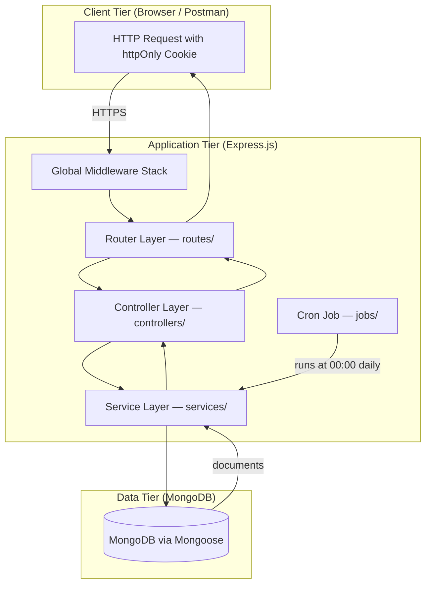

# 01 — Architecture

## 3-Tier Architecture Diagram



---

## Layer Responsibilities

| Layer | Folder | Rule |
|---|---|---|
| Router | `routes/` | Declares paths, HTTP methods, attaches middleware and validators, calls controllers |
| Controller | `controllers/` | Reads `req`, calls one or more service functions, calls `sendSuccess` or `sendError` |
| Service | `services/` | All business logic, DB queries, AI calls, email. No `req`/`res` objects |
| Model | `models/` | Mongoose schema definitions only. No business logic |
| Middleware | `middleware/` | Cross-cutting: auth, validation, upload, rate limit, error handler |
| Config | `config/` | DB connection, Swagger spec, shared constants |
| Utils | `utils/` | Pure helpers: `money.js` (toCents/toAmount), `response.js` (sendSuccess/sendError), `crypto.js` (hash/compare) |
| Jobs | `jobs/` | Node-cron scheduled tasks |

---

## Middleware Execution Order (server.js)

Middleware runs in the exact order it appears in `server.js`:

1. `helmet()` — Sets secure HTTP response headers
2. `cors({ origin: CLIENT_URL, credentials: true })` — Allows cross-origin requests with cookies from the configured frontend origin
3. `express.json()` — Parses JSON request bodies
4. `cookieParser()` — Makes `req.cookies` available (required for reading the `jwt` cookie)
5. `express-mongo-sanitize` — Strips MongoDB operator characters (`$`, `.`) from request data to prevent NoSQL injection
6. Route handlers (all `/api/*` paths)
7. 404 catch-all handler (wildcard `*`)
8. `errorHandler` — Centralised error handler; reads `err.statusCode` or falls back to 500

---

## Folder Structure (Real Tree)

```
server/
├── config/
│   ├── constants.js        # ROLES, CURRENCIES, HTTP_STATUS enums
│   ├── db.js               # Mongoose connect function
│   └── swagger.js          # OpenAPI 3.0 spec builder (swagger-jsdoc)
├── controllers/
│   ├── activityController.js
│   ├── adminController.js
│   ├── aiController.js
│   ├── announcementController.js
│   ├── authController.js
│   ├── bookmarkController.js
│   ├── budgetController.js
│   ├── categoryController.js
│   ├── dashboardController.js
│   ├── notificationController.js
│   ├── recurringController.js
│   ├── reportController.js
│   ├── transactionController.js
│   ├── transactionTemplateController.js
│   └── userController.js
├── jobs/
│   └── recurringCron.js    # node-cron daily midnight job
├── middleware/
│   ├── auth.js             # requireAuth (protect alias) — JWT cookie verification
│   ├── errorHandler.js     # Centralised Express error handler
│   ├── rateLimiter.js      # apiLimiter (100/15 min) and authLimiter (10/15 min)
│   ├── upload.js           # Multer CSV upload (2 MB limit, .csv only)
│   └── validate.js         # Zod schema validation middleware factory
├── models/
│   ├── ActivityLog.js
│   ├── Announcement.js
│   ├── Bookmark.js
│   ├── Budget.js
│   ├── Category.js
│   ├── CategoryCorrection.js
│   ├── Insight.js
│   ├── Notification.js
│   ├── RecurringRule.js
│   ├── Tip.js
│   ├── TipAction.js
│   ├── TipTemplate.js
│   ├── Transaction.js
│   ├── TransactionTemplate.js
│   └── User.js
├── routes/
│   ├── activityRoutes.js
│   ├── adminRoutes.js
│   ├── aiRoutes.js
│   ├── announcementRoutes.js
│   ├── authRoutes.js
│   ├── bookmarkRoutes.js
│   ├── budgetRoutes.js
│   ├── categoryRoutes.js
│   ├── dashboardRoutes.js
│   ├── notificationRoutes.js
│   ├── recurringRoutes.js
│   ├── reportRoutes.js
│   ├── transactionRoutes.js
│   ├── transactionTemplateRoutes.js
│   └── userRoutes.js
├── seed/
│   └── seed.js
├── services/
│   ├── activityService.js
│   ├── adminService.js
│   ├── aiCategorizerService.js
│   ├── aiInsightsService.js
│   ├── anomalyService.js
│   ├── authService.js
│   ├── bookmarkService.js
│   ├── budgetService.js
│   ├── categoryService.js
│   ├── csvImportService.js
│   ├── dashboardService.js
│   ├── emailService.js
│   ├── forecastService.js
│   ├── notificationService.js
│   ├── pdfService.js
│   ├── receiptOcrService.js
│   ├── recurringService.js
│   ├── reportService.js
│   ├── tipsEngineService.js
│   ├── transactionService.js
│   ├── transactionTemplateService.js
│   └── userService.js
├── utils/
│   ├── crypto.js           # bcrypt hash and compare helpers
│   ├── money.js            # toCents, fromCents (toAmount alias)
│   └── response.js         # sendSuccess, sendError helpers
├── validators/
│   ├── adminValidator.js
│   ├── aiValidator.js
│   ├── authValidator.js
│   ├── bookmarkValidator.js
│   ├── budgetValidator.js
│   ├── categoryValidator.js
│   ├── recurringValidator.js
│   ├── reportValidator.js
│   └── transactionValidator.js
├── docs/                   # ← This documentation folder
├── .env
├── .env.example
├── package.json
├── restore.js
└── server.js
```

---

## Tech Stack — Purpose of Each Package

| Package | Version | Purpose |
|---|---|---|
| `express` | ^4.21.2 | HTTP server framework — routing, middleware pipeline |
| `mongoose` | ^8.9.3 | MongoDB ODM — schema definitions, validation, query building, aggregations |
| `bcryptjs` | ^2.4.3 | Password hashing (salt rounds: 10) and comparison |
| `jsonwebtoken` | ^9.0.2 | Signing and verifying JWT tokens sent in `httpOnly` cookies |
| `cookie-parser` | ^1.4.7 | Parses the `Cookie` header so `req.cookies.jwt` is accessible |
| `cors` | ^2.8.5 | Cross-Origin Resource Sharing — permits the configured `CLIENT_URL` to send credentialed requests |
| `helmet` | ^8.0.0 | Sets secure HTTP headers (CSP, HSTS, X-Frame-Options, etc.) |
| `express-mongo-sanitize` | ^2.2.0 | Strips `$` and `.` from request data to block NoSQL injection |
| `express-rate-limit` | ^7.5.0 | Rate limiting — `authLimiter` (10/15 min) and `apiLimiter` (100/15 min) |
| `dotenv` | ^16.4.7 | Loads `.env` file variables into `process.env` |
| `zod` | ^3.24.1 | Runtime schema validation for all request bodies |
| `multer` | ^1.4.5-lts.1 | Multipart form-data parsing for CSV and image file uploads |
| `csv-parse` | ^5.6.0 | Parses CSV buffer to JavaScript objects with column mapping |
| `natural` | ^8.0.1 | NLP library — provides the Naive Bayes Classifier used in AI categorization |
| `@google/generative-ai` | ^0.21.0 | Gemini API client — used for monthly spending narrative insights and receipt OCR |
| `node-cron` | ^3.0.3 | Schedules the daily midnight recurring transaction job (`0 0 * * *`) |
| `nodemailer` | ^6.9.16 | Sends budget alert and report emails via SMTP |
| `pdfkit` | ^0.16.0 | Generates PDF monthly spending reports for download or email |
| `swagger-jsdoc` | ^6.2.8 | Builds OpenAPI 3.0 spec from JSDoc annotations in route files |
| `swagger-ui-express` | ^5.0.1 | Serves the interactive Swagger UI at `/api/docs` |
