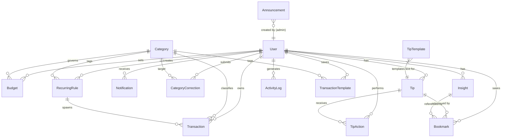

# 02 — Database

## ER Diagram

---

## Collection: `users`

| Field | Type | Default | Notes |
|---|---|---|---|
| `name` | String | — | Required, trimmed |
| `email` | String | — | Required, unique, lowercase, indexed |
| `passwordHash` | String | — | Required; `select: false` — never returned by default |
| `role` | String enum | `student` | Values: `student`, `admin` |
| `academicYear` | String | `1st Year` | Free text, trimmed |
| `monthlyAllowanceBaseline` | Number | `0` | Stored as **integer cents**; min 0 |
| `monthlySavingsGoal` | Number | `0` | Stored as **integer cents**; min 0 |
| `currency` | String enum | `USD` | Values: `USD`, `EUR`, `GBP` |
| `isActive` | Boolean | `true` | Admins can toggle this |
| `resetTokenHash` | String | — | `select: false` — never returned by default |
| `resetTokenExpires` | Date | — | `select: false` — never returned by default |
| `createdAt` | Date | auto | Managed by timestamps |
| `updatedAt` | Date | auto | Managed by timestamps |

**Indexes:** `email` (unique)

**toJSON transform:** Deletes `passwordHash`, `resetTokenHash`, `resetTokenExpires`, and `__v` from all serialised output — second safety net on top of `select: false`.

---

## Collection: `transactions`

| Field | Type | Default | Notes |
|---|---|---|---|
| `user` | ObjectId → User | — | Required, indexed |
| `category` | ObjectId → Category | — | Required |
| `type` | String enum | — | `income` or `expense`; required |
| `amount` | Number | — | Required; stored as **integer cents**; min 1 |
| `description` | String | `''` | Trimmed |
| `date` | Date | `Date.now` | Required |
| `isRecurring` | Boolean | `false` | Set to `true` by the cron job |
| `recurringRule` | ObjectId → RecurringRule | `null` | Set by cron job |
| `aiSuggestedCategory` | ObjectId → Category | `null` | Written by AI categorizer on create |
| `isFlagged` | Boolean | `false` | Set by anomaly/duplicate detector |
| `flagReason` | String | `''` | Human-readable reason when flagged |
| `deletedAt` | Date | `null` | Soft-delete field; `null` = active; indexed |
| `createdAt` | Date | auto | Timestamps |
| `updatedAt` | Date | auto | Timestamps |

**Indexes:**
- `{ user: 1, date: -1 }` — fast recency list per user
- `{ user: 1, category: 1, date: -1 }` — filtered queries by category
- `deletedAt` (single field) — fast exclusion of deleted rows

**Soft Delete Rule:** All queries must include `deletedAt: null` to exclude soft-deleted rows. Hard delete is not used.

---

## Collection: `categories`

| Field | Type | Default | Notes |
|---|---|---|---|
| `name` | String | — | Required, trimmed |
| `type` | String enum | — | `income` or `expense`; required |
| `isDefault` | Boolean | `false` | `true` for system categories (admin-created); `false` for user-created |
| `owner` | ObjectId → User | `null` | `null` for system categories; user ObjectId for custom |
| `icon` | String | `tag` | Icon name/emoji |
| `color` | String | `#4F46E5` | Hex colour |
| `createdAt` | Date | auto | Timestamps |
| `updatedAt` | Date | auto | Timestamps |

**Indexes:**
- `{ owner: 1, type: 1 }` — list categories for a user by type
- `{ isDefault: 1 }` — list all system categories

---

## Collection: `budgets`

| Field | Type | Default | Notes |
|---|---|---|---|
| `user` | ObjectId → User | — | Required, indexed |
| `category` | ObjectId → Category | — | Required |
| `month` | String | — | Format `YYYY-MM`, e.g. `2026-09`; required |
| `limitAmount` | Number | — | Required; stored as **integer cents**; min 1 |
| `createdAt` | Date | auto | Timestamps |
| `updatedAt` | Date | auto | Timestamps |

**Indexes:** `{ user: 1, category: 1, month: 1 }` (unique) — one budget per user per category per month.

---

## Collection: `notifications`

| Field | Type | Default | Notes |
|---|---|---|---|
| `user` | ObjectId → User | — | Required, indexed |
| `title` | String | — | Required, trimmed |
| `message` | String | — | Required, trimmed |
| `type` | String enum | `system` | Values: `budget_alert`, `anomaly`, `system` |
| `isRead` | Boolean | `false` | Indexed |
| `createdAt` | Date | auto | `updatedAt` disabled in schema |

**Indexes:** `{ user: 1, isRead: 1, createdAt: -1 }` — fast unread-first list per user.

---

## Collection: `recurringrules`

| Field | Type | Default | Notes |
|---|---|---|---|
| `user` | ObjectId → User | — | Required, indexed |
| `category` | ObjectId → Category | — | Required |
| `type` | String enum | — | `income` or `expense`; required |
| `amount` | Number | — | Required; stored as **integer cents**; min 1 |
| `description` | String | `''` | Trimmed |
| `frequency` | String enum | `monthly` | Values: `weekly`, `monthly` |
| `nextRunDate` | Date | — | Required, indexed; advanced by cron job after each run |
| `isActive` | Boolean | `true` | Inactive rules are skipped by the cron job |
| `createdAt` | Date | auto | Timestamps |
| `updatedAt` | Date | auto | Timestamps |

---

## Collection: `categorycorrections`

| Field | Type | Default | Notes |
|---|---|---|---|
| `user` | ObjectId → User | — | Required, indexed |
| `descriptionKeyword` | String | — | Required; lowercase, trimmed; the word the user typed |
| `correctedCategory` | ObjectId → Category | — | Required; the category the user confirmed |
| `count` | Number | `1` | Incremented on each duplicate correction for the same keyword |
| `createdAt` | Date | auto | Timestamps |
| `updatedAt` | Date | auto | Timestamps |

**Indexes:** `{ user: 1, descriptionKeyword: 1 }` (unique) — one correction record per user per keyword.

---

## Collection: `insights`

| Field | Type | Default | Notes |
|---|---|---|---|
| `user` | ObjectId → User | — | Required, indexed |
| `month` | String | — | Format `YYYY-MM`; required |
| `summaryText` | String | — | Required; narrative generated by LLM or template |
| `tipText` | String | — | Required; actionable saving tip |
| `source` | String enum | `template` | Values: `llm`, `template` |
| `generatedAt` | Date | `Date.now` | — |
| `createdAt` | Date | auto | Timestamps |
| `updatedAt` | Date | auto | Timestamps |

**Indexes:** `{ user: 1, month: 1 }` (unique) — one insight per user per month (cached).

---

## Collection: `tips`

| Field | Type | Default | Notes |
|---|---|---|---|
| `user` | ObjectId → User | — | Required, indexed |
| `ruleType` | String enum | — | Values: `spending_spike`, `budget_warning`, `savings_goal_at_risk`; required |
| `text` | String | — | Required; the tip message text |
| `potentialSavings` | Number | `0` | Stored as **integer cents** |
| `month` | String | — | Format `YYYY-MM`; required |
| `createdAt` | Date | auto | `updatedAt` disabled in schema |

---

## Collection: `tipactions`

| Field | Type | Default | Notes |
|---|---|---|---|
| `user` | ObjectId → User | — | Required, indexed |
| `tip` | ObjectId → Tip | — | Required |
| `action` | String enum | — | Values: `pinned`, `dismissed`; required |
| `createdAt` | Date | auto | Timestamps |
| `updatedAt` | Date | auto | Timestamps |

**Indexes:** `{ user: 1, tip: 1 }` (unique) — one action record per user per tip (upserted on each change).

---

## Collection: `tiptemplates`

| Field | Type | Default | Notes |
|---|---|---|---|
| `ruleType` | String enum | — | Values: `spending_spike`, `budget_warning`, `savings_goal_at_risk`; required |
| `template` | String | — | Required, trimmed. Supports `{category}`, `{excess}`, `{remaining}`, `{deficit}` placeholders |
| `isActive` | Boolean | `true` | Only active templates are used by the tips engine |
| `createdAt` | Date | auto | Timestamps |
| `updatedAt` | Date | auto | Timestamps |

No indexes beyond the default `_id`. The tips engine queries `{ ruleType, isActive: true }` sorted by `updatedAt -1`.

---

## Collection: `bookmarks`

| Field | Type | Default | Notes |
|---|---|---|---|
| `user` | ObjectId → User | — | Required, indexed |
| `refType` | String enum | — | Values: `tip`, `insight`; required |
| `refId` | ObjectId | — | Required; points to a Tip or Insight document |
| `note` | String | `''` | Optional student annotation; max 500 characters |
| `createdAt` | Date | auto | `updatedAt` disabled in schema |

**Indexes:** `{ user: 1, refType: 1, refId: 1 }` (unique) — a user cannot bookmark the same item twice.

---

## Collection: `announcements`

| Field | Type | Default | Notes |
|---|---|---|---|
| `title` | String | — | Required |
| `message` | String | — | Required |
| `isActive` | Boolean | `true` | Students only see active announcements |
| `createdBy` | ObjectId → User | — | Required; should be an admin |
| `createdAt` | Date | auto | Timestamps |
| `updatedAt` | Date | auto | Timestamps |

No additional indexes.

---

## Collection: `activitylogs`

| Field | Type | Default | Notes |
|---|---|---|---|
| `user` | ObjectId → User | — | Required |
| `action` | String enum | — | Values: `view`, `create`, `edit`; required |
| `entity` | String | `transaction` | Extensible entity type label |
| `entityId` | ObjectId | — | Required; points to the Transaction |
| `at` | Date | `Date.now` | When the action occurred |

**Indexes:** `{ user: 1, at: -1 }` — fast recency lookup per user.

---

## Collection: `transactiontemplates`

| Field | Type | Default | Notes |
|---|---|---|---|
| `user` | ObjectId → User | — | Required |
| `name` | String | — | Required; template label |
| `amount` | Number | — | Required; stored as **integer cents** |
| `category` | ObjectId → Category | — | Required |
| `type` | String enum | — | `income` or `expense`; required |
| `description` | String | `''` | Optional note |
| `createdAt` | Date | auto | Timestamps |
| `updatedAt` | Date | auto | Timestamps |

---

## Money Storage Rule

All monetary values across all collections are stored as **integer cents** (e.g. $15.50 → `1550`). The `toAmount()` / `toCents()` helpers in `utils/money.js` convert at the API boundary — amounts enter the service as display numbers and are always converted to cents before persistence, and always converted back to display numbers before being returned in JSON responses.
