# 04 — System Flows

## 1. Register / Login / Admin Login

```mermaid
sequenceDiagram
    actor C as Client
    participant R as authRoutes
    participant M as authLimiter (10/15 min)
    participant S as authService
    participant DB as MongoDB (users)

    C->>R: POST /api/auth/register { name, email, password }
    R->>M: Rate limit check
    M-->>R: OK
    R->>S: register(data)
    S->>DB: Check email not duplicate
    S->>S: bcrypt.hash(password, 10)
    S->>DB: User.create({ name, email, passwordHash, role: 'student' })
    S->>S: jwt.sign({ id }, JWT_SECRET, { expiresIn: '7d' })
    S-->>R: { token, user (no hash) }
    R->>C: Set httpOnly cookie 'jwt'; 201 { user }

    C->>R: POST /api/auth/login { email, password }
    R->>M: Rate limit check
    R->>S: login(email, password)
    S->>DB: User.findOne({ email }).select('+passwordHash')
    S->>S: bcrypt.compare(password, hash)
    S->>S: delete user.passwordHash (explicit unset)
    S->>S: jwt.sign({ id }, JWT_SECRET)
    R->>C: Set httpOnly cookie 'jwt'; 200 { user }
```

> Admin login uses the **same** `POST /api/auth/login` endpoint. The cookie returned contains the admin's `id` and their `role` is read from the database on each request by `requireAuth`.

---

## 2. Password Reset (Student Self-Service)

> **Note:** A forgot-password service exists (`emailService.js` is present and `nodemailer` is installed). However, the forget-password route is **not mounted** in `server.js`. The flow described here is the admin-initiated reset only (which is fully implemented).

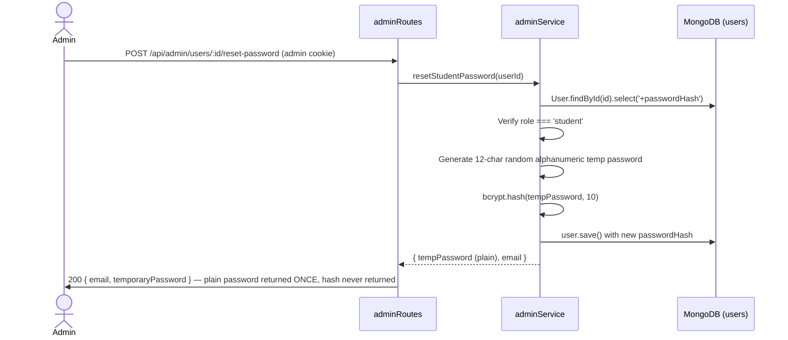

---

## 3. Transaction Create (with Budget Alert and Anomaly Check)

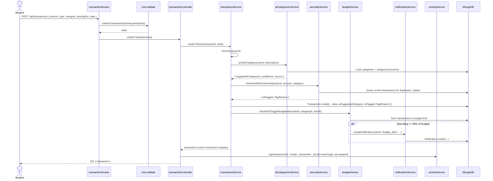

---

## 4. Recurring Cron Job (Daily Midnight)

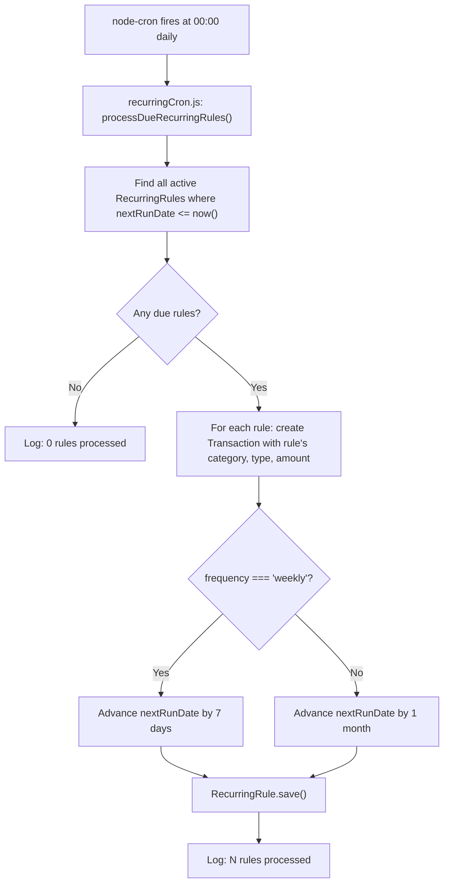

---

## 5. CSV Import — Preview and Confirm

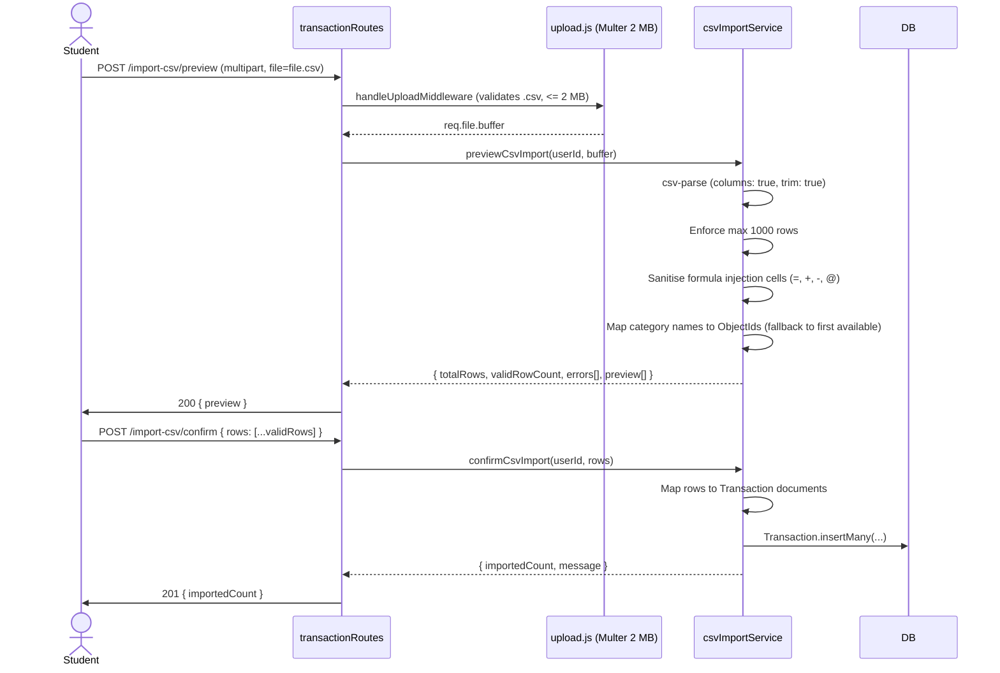

---

## 6. AI Categorization Priority and Feedback

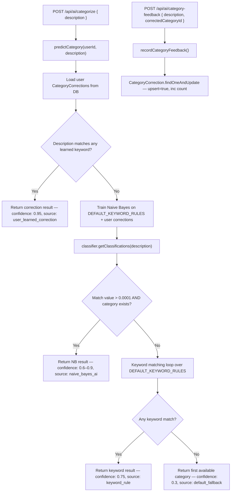

---

## 7. Monthly Insights (LLM vs Template Fallback)

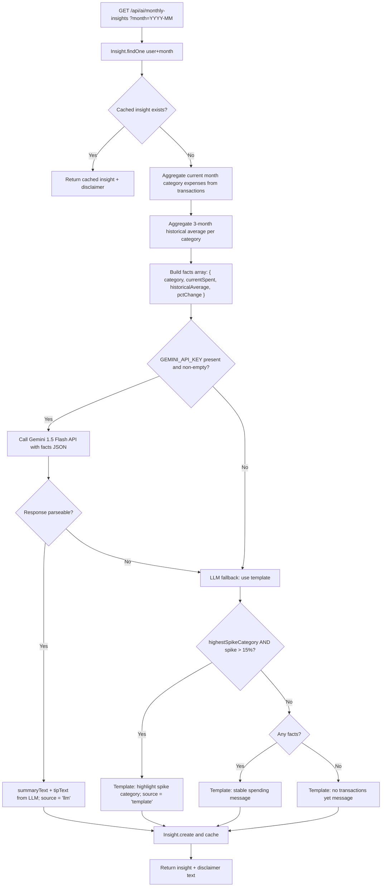

---

## 8. Tips Engine (Rules + Pin/Dismiss)

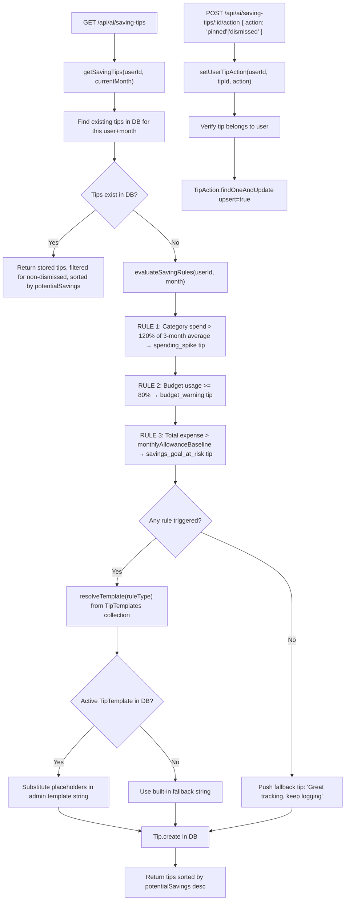

---

## 9. Forecast

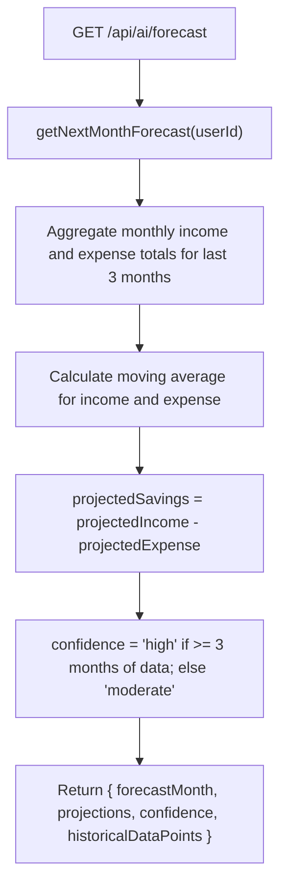

---

## 10. Receipt OCR

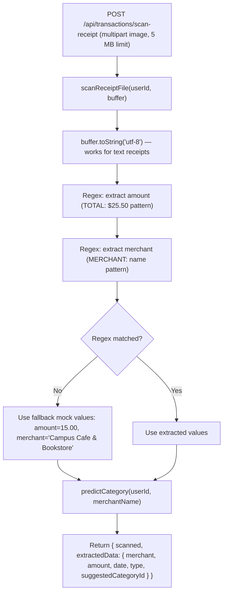

> **Limitation:** The OCR service uses regex on the text content of the buffer, not actual computer-vision OCR. Binary image files will always fall back to mock values.

---

## 11. Bookmarks

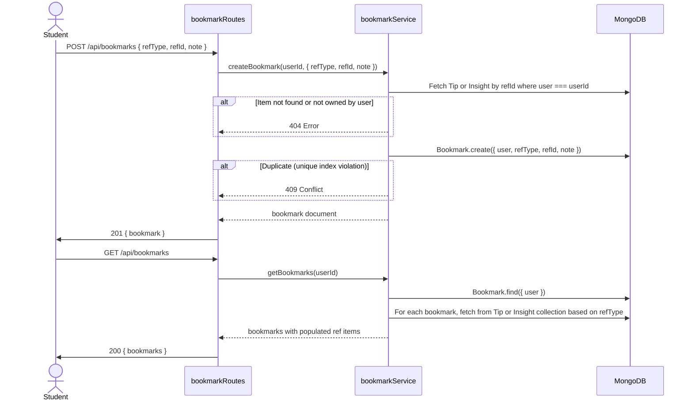

---

## 12. Admin Actions

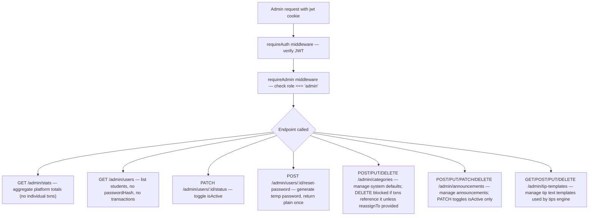

---

## 13. Activity Log

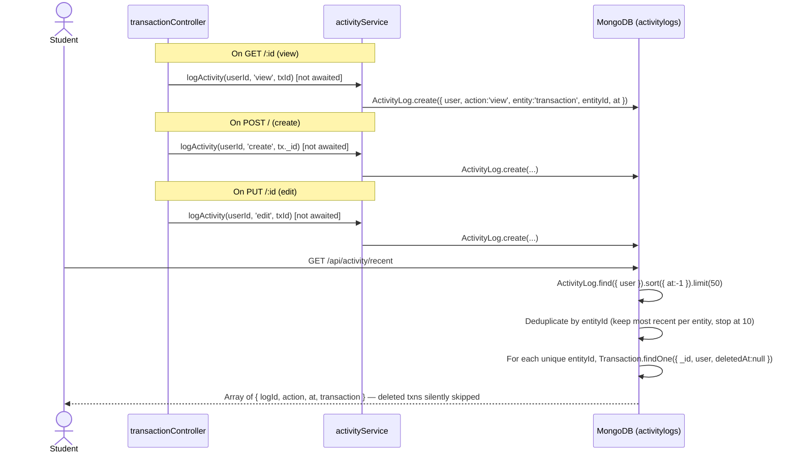
