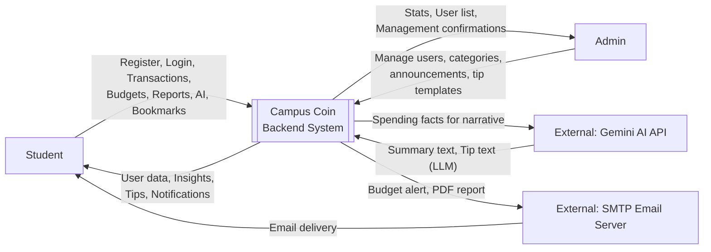
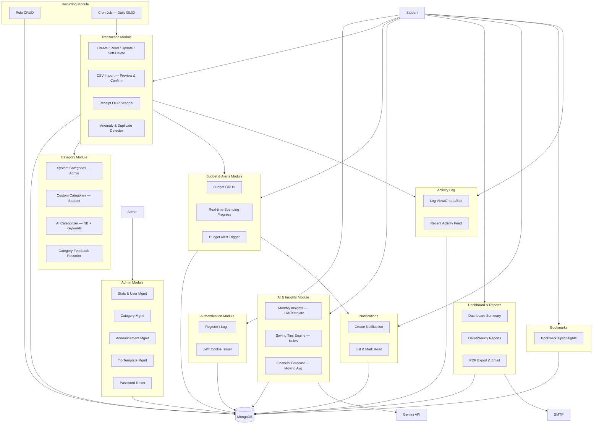

# 05 — Data Flow Diagrams

## DFD Level 0 — Context Diagram

```mermaid
flowchart LR
    S[Student]
    A[Admin]
    E[External: Gemini AI API]
    SMTP[External: SMTP Email Server]

    S -- "Register, Login, Transactions,\nBudgets, Reports, AI, Bookmarks" --> SYS[["Campus Coin\nBackend System"]]
    SYS -- "User data, Insights,\nTips, Notifications" --> S

    A -- "Manage users, categories,\nannouncements, tip templates" --> SYS
    SYS -- "Stats, User list,\nManagement confirmations" --> A

    SYS -- "Spending facts for narrative" --> E
    E -- "Summary text, Tip text (LLM)" --> SYS

    SYS -- "Budget alert, PDF report" --> SMTP
    SMTP -- "Email delivery" --> S
```

---

## DFD Level 1 — Major Subsystems

```mermaid
flowchart TB
    S[Student]
    A[Admin]
    GEM[Gemini API]
    SMTP[SMTP]

    subgraph AUTH["Authentication Module"]
        A1[Register / Login]
        A2[JWT Cookie Issuer]
    end

    subgraph TXN["Transaction Module"]
        T1[Create / Read / Update / Soft-Delete]
        T2[CSV Import — Preview & Confirm]
        T3[Receipt OCR Scanner]
        T4[Anomaly & Duplicate Detector]
    end

    subgraph CAT["Category Module"]
        C1[System Categories — Admin]
        C2[Custom Categories — Student]
        C3[AI Categorizer — NB + Keywords]
        C4[Category Feedback Recorder]
    end

    subgraph BUDGET["Budget & Alerts Module"]
        B1[Budget CRUD]
        B2[Real-time Spending Progress]
        B3[Budget Alert Trigger]
    end

    subgraph AI["AI & Insights Module"]
        AI1[Monthly Insights — LLM/Template]
        AI2[Saving Tips Engine — Rules]
        AI3[Financial Forecast — Moving Avg]
    end

    subgraph DASH["Dashboard & Reports"]
        D1[Dashboard Summary]
        D2[Daily/Weekly Reports]
        D3[PDF Export & Email]
    end

    subgraph NOTIF["Notifications"]
        N1[Create Notification]
        N2[List & Mark Read]
    end

    subgraph ADMIN["Admin Module"]
        AD1[Stats & User Mgmt]
        AD2[Category Mgmt]
        AD3[Announcement Mgmt]
        AD4[Tip Template Mgmt]
        AD5[Password Reset]
    end

    subgraph REC["Recurring Module"]
        R1[Rule CRUD]
        R2[Cron Job — Daily 00:00]
    end

    subgraph BM["Bookmarks"]
        BK1[Bookmark Tips/Insights]
    end

    subgraph ACT["Activity Log"]
        L1[Log View/Create/Edit]
        L2[Recent Activity Feed]
    end

    DB[(MongoDB)]

    S --> AUTH --> DB
    S --> TXN --> DB
    S --> BUDGET --> DB
    S --> AI --> DB
    S --> DASH --> DB
    S --> NOTIF --> DB
    S --> BM --> DB
    S --> ACT --> DB
    A --> ADMIN --> DB

    TXN --> CAT
    TXN --> BUDGET
    TXN --> ACT
    AI --> GEM
    DASH --> SMTP
    BUDGET --> NOTIF
    R2 --> TXN
    R1 --> DB
```
