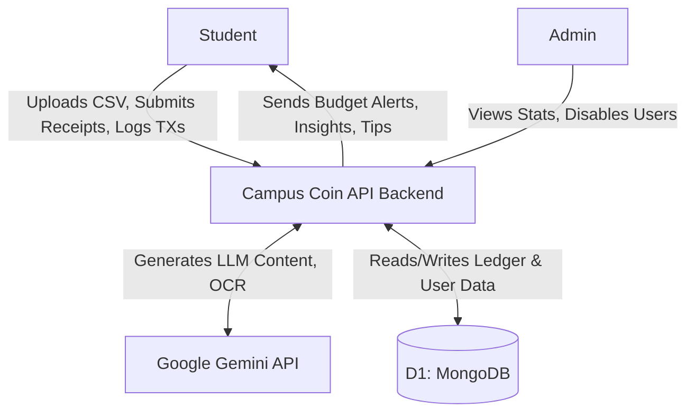
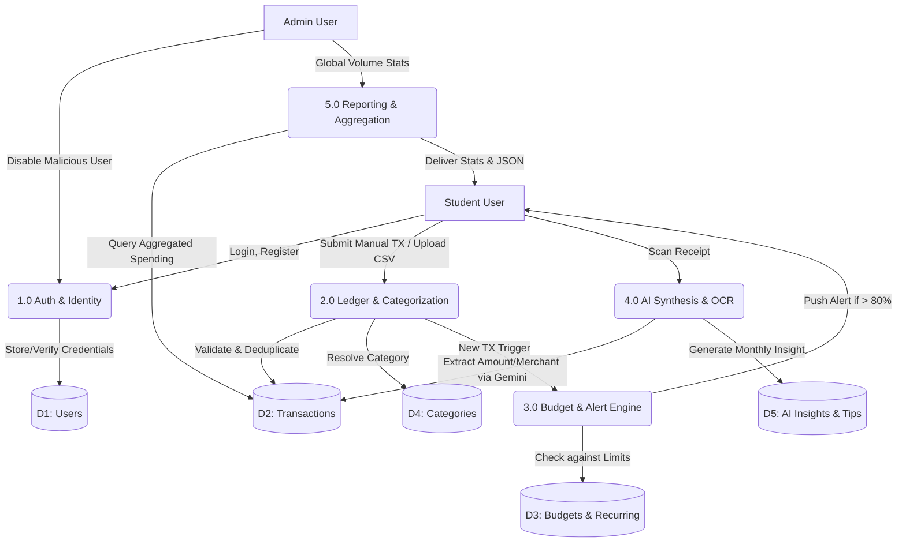

# WORKING DRAFT for the team. The final report must be written by the team.

# Data Flow Diagrams

## DFD Level 0 (Context Diagram)

```mermaid
graph TD
    Student[Student] -->|Uploads CSV, Submits Receipts, Logs TXs| API[Campus Coin API Backend]
    API -->|Sends Budget Alerts, Insights, Tips| Student
    
    Admin[Admin] -->|Views Stats, Disables Users| API
    
    API <-->|Generates LLM Content, OCR| Gemini[Google Gemini API]
    API <-->|Reads/Writes Ledger & User Data| DB[(D1: MongoDB)]
```

## DFD Level 1 (Core Processes)

```mermaid
graph TD
    Student[Student User]
    Admin[Admin User]
    
    %% Data Stores
    D1[(D1: Users)]
    D2[(D2: Transactions)]
    D3[(D3: Budgets & Recurring)]
    D4[(D4: Categories)]
    D5[(D5: AI Insights & Tips)]
    
    %% Processes
    P1(1.0 Auth & Identity)
    P2(2.0 Ledger & Categorization)
    P3(3.0 Budget & Alert Engine)
    P4(4.0 AI Synthesis & OCR)
    P5(5.0 Reporting & Aggregation)
    
    Student -->|Login, Register| P1
    P1 -->|Store/Verify Credentials| D1
    
    Student -->|Submit Manual TX / Upload CSV| P2
    P2 -->|Validate & Deduplicate| D2
    P2 -->|Resolve Category| D4
    
    P2 -->|New TX Trigger| P3
    P3 -->|Check against Limits| D3
    P3 -->|Push Alert if > 80%| Student
    
    Student -->|Scan Receipt| P4
    P4 -->|Extract Amount/Merchant via Gemini| D2
    
    P4 -->|Generate Monthly Insight| D5
    P5 -->|Query Aggregated Spending| D2
    P5 -->|Deliver Stats & JSON| Student
    
    Admin -->|Disable Malicious User| P1
    Admin -->|Global Volume Stats| P5
```
