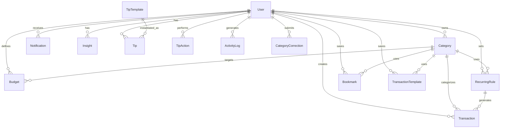

# WORKING DRAFT for the team. The final report must be written by the team.

# Database Schema & ER Diagram

## Entity Relationship Diagram (ERD)

## Collection Details

### User
| Field | Type | Default | Ref | Rules / Indexes |
|---|---|---|---|---|
| name | String | | | Required |
| email | String | | | Required, Unique, Indexed |
| password | String | | | Required (Hashed) |
| role | String | 'student' | | Enum: student, admin |
| resetPasswordToken | String | | | |
| resetPasswordExpire | Date | | | |
| isActive | Boolean | true | | |
| academicYear | String | | | Enum: Freshman, Sophomore, Junior, Senior, Grad |
| currency | String | 'USD' | | Enum: USD, PKR, INR, EUR |

### Category
| Field | Type | Default | Ref | Rules / Indexes |
|---|---|---|---|---|
| name | String | | | Required |
| type | String | | | Enum: income, expense |
| icon | String | | | |
| color | String | | | |
| isDefault | Boolean | false | | Global categories |
| owner | ObjectId | | User | Nullable if isDefault |

### Transaction
| Field | Type | Default | Ref | Rules / Indexes |
|---|---|---|---|---|
| user | ObjectId | | User | Required, Indexed |
| amount | Number | | | Required (Cents) |
| type | String | | | Enum: income, expense |
| category | ObjectId | | Category | Required |
| description | String | '' | | |
| date | Date | Date.now | | Indexed |
| isRecurring | Boolean | false | | |
| recurringRule | ObjectId| | RecurringRule | |
| isFlagged | Boolean | false | | Anomaly check |
| flagReason | String | | | |
| needsReview | Boolean | false | | CSV import check |
| deletedAt | Date | null | | Soft delete flag |

### Budget
| Field | Type | Default | Ref | Rules / Indexes |
|---|---|---|---|---|
| user | ObjectId | | User | Required |
| category | ObjectId | | Category | Required |
| month | String | | | Required (YYYY-MM) |
| limitAmount | Number | | | Required (Cents) |
*Compound Index*: { user, category, month } (Unique)

### RecurringRule
| Field | Type | Default | Ref | Rules / Indexes |
|---|---|---|---|---|
| user | ObjectId | | User | Required |
| amount | Number | | | Required (Cents) |
| type | String | | | Enum: income, expense |
| category | ObjectId | | Category | Required |
| description | String | '' | | |
| frequency | String | 'monthly' | | Enum: daily, weekly, monthly, yearly |
| nextRunDate | Date | | | Required |
| isActive | Boolean | true | | |

### Bookmark (Legacy)
| Field | Type | Default | Ref | Rules / Indexes |
|---|---|---|---|---|
| user, name, amount, type, category, description | ... | ... | User, Category | Same as Transaction |

### TransactionTemplate
| Field | Type | Default | Ref | Rules / Indexes |
|---|---|---|---|---|
| user, name, amount, type, category, description | ... | ... | User, Category | Quick-entry templates |

### Notification
| Field | Type | Default | Ref | Rules / Indexes |
|---|---|---|---|---|
| user | ObjectId | | User | Required |
| title | String | | | Required |
| message | String | | | Required |
| type | String | 'info' | | Enum: alert, info, warning |
| isRead | Boolean | false | | |

### Announcement (Global)
| Field | Type | Default | Ref | Rules / Indexes |
|---|---|---|---|---|
| title, content | String | | | Required |
| isActive | Boolean | true | | |

### Insight
| Field | Type | Default | Ref | Rules / Indexes |
|---|---|---|---|---|
| user | ObjectId | | User | Required |
| month | String | | | YYYY-MM |
| insight | String | | | LLM Markdown content |

### TipTemplate (Admin Defined)
| Field | Type | Default | Ref | Rules / Indexes |
|---|---|---|---|---|
| title, description, ruleType, savingsPotential, isActive | ... | ... | | Rule definitions for tip engine |

### Tip (User Specific)
| Field | Type | Default | Ref | Rules / Indexes |
|---|---|---|---|---|
| user | ObjectId | | User | Required |
| template | ObjectId | | TipTemplate | Required |
| context | String | | | Dynamic LLM text |

### TipAction
| Field | Type | Default | Ref | Rules / Indexes |
|---|---|---|---|---|
| user | ObjectId | | User | Required |
| tipId | ObjectId | | Tip | Required |
| action | String | | | Enum: pinned, dismissed |

### CategoryCorrection (AI Feedback)
| Field | Type | Default | Ref | Rules / Indexes |
|---|---|---|---|---|
| user | ObjectId | | User | |
| originalDescription | String | | | Required |
| correctedCategoryId | ObjectId| | Category | Required |

### ActivityLog
| Field | Type | Default | Ref | Rules / Indexes |
|---|---|---|---|---|
| user | ObjectId | | User | Required |
| entityId | ObjectId | | Any | Target reference |
| action | String | | | Enum: view, create, edit, delete |
| entityType | String | | | Enum: transaction, budget |
