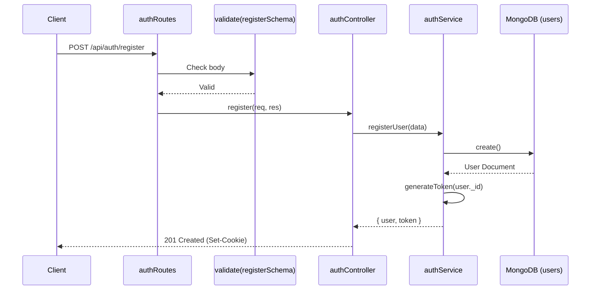
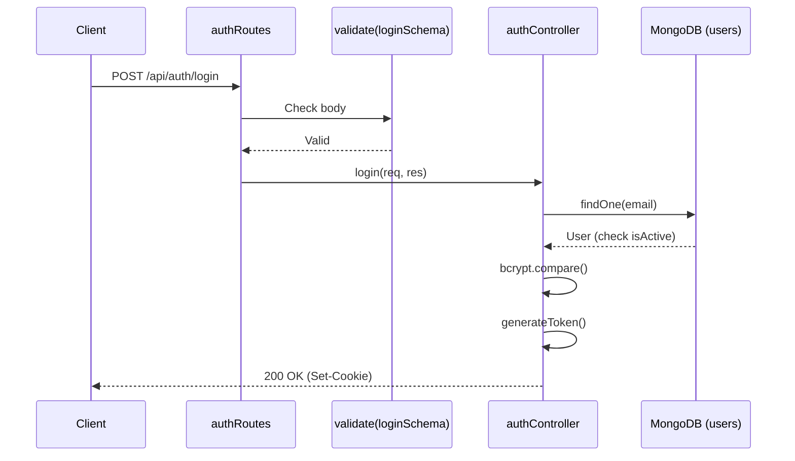
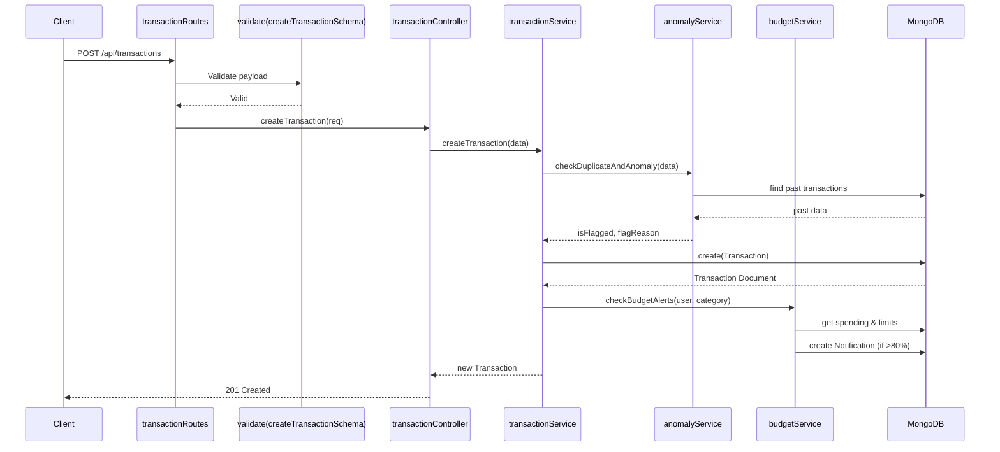
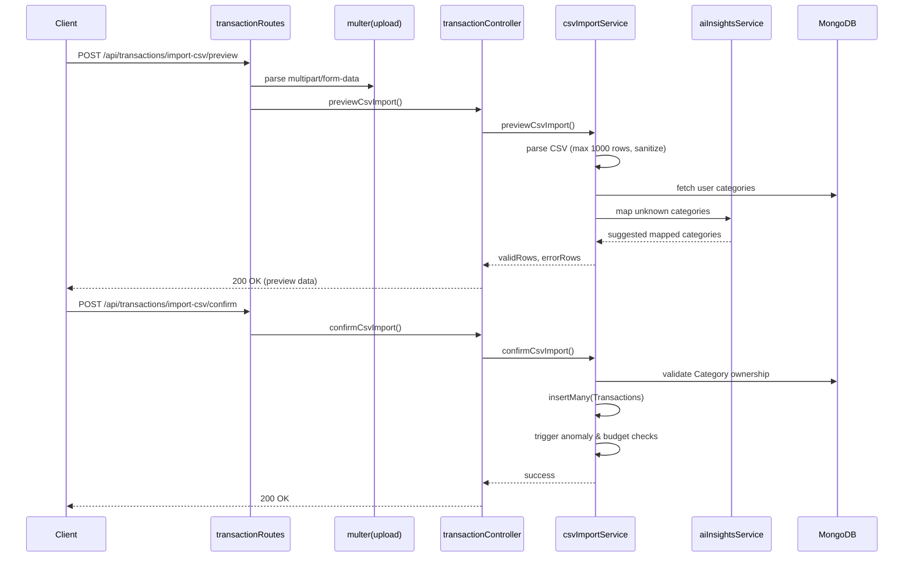
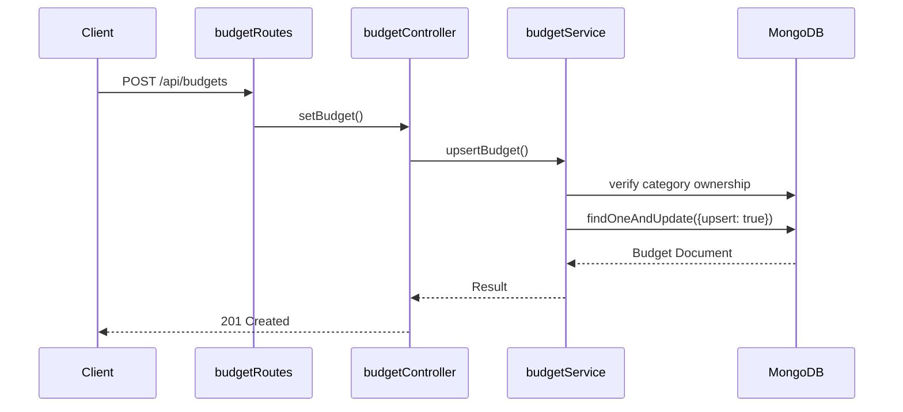
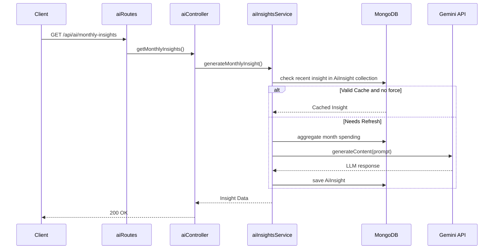

# WORKING DRAFT for the team. The final report must be written by the team.

# Flow Coverage Inventory

| Flow Name | Routes Covered | Diagram | SRS IDs |
|-----------|----------------|---------|---------|
| 1. Register | `POST /api/auth/register` | Flow 1 | A1 |
| 2. Student Login | `POST /api/auth/login` | Flow 2 | A2 |
| 3. Admin Login | `POST /api/auth/admin-login` | Flow 3 | AD1 |
| 4. Logout | `POST /api/auth/logout` | Flow 4 | A4 |
| 5. Forgot/Reset Password | `POST /api/auth/forgot-password`, `POST /api/auth/reset-password` | Flow 5 | A3 |
| 6. Profile Update | `GET /api/users/profile`, `PUT /api/users/profile` | Flow 6 | L1, L2 |
| 7. Category CRUD | `GET /api/categories`, `POST /api/categories`, `PUT /api/categories/:id`, `DELETE /api/categories/:id` | Flow 7 | C1, C2, C3, C4 |
| 8. Transaction Create (AI, Anomaly, Budget) | `POST /api/transactions` | Flow 8 | T1, D1, D2, D3, B2 |
| 9. Transaction Edit & Soft Delete | `GET /api/transactions`, `GET /api/transactions/:id`, `PUT /api/transactions/:id`, `DELETE /api/transactions/:id` | Flow 9 | T2, T3 |
| 10. Recurring Rule & Cron | `POST /api/recurring`, `GET /api/recurring`, `PUT /api/recurring/:id`, `DELETE /api/recurring/:id` | Flow 10 | R1, R2, R3, R4, R5 |
| 11. CSV Preview & Confirm | `POST /api/transactions/import-csv/preview`, `POST /api/transactions/import-csv/confirm` | Flow 11 | I1, I2, I3, I4 |
| 12. AI Categorize & Feedback | `POST /api/ai/predict-category`, `POST /api/ai/feedback` | Flow 12 | AC1, AC2, AC3, AC4 |
| 13. Budget Set & Alerts | `POST /api/budgets`, `GET /api/budgets`, `DELETE /api/budgets/:id` | Flow 13 | B1, B2, B3 |
| 14. Dashboard Summary | `GET /api/dashboard/summary` | Flow 14 | S1 |
| 15. Reports | `GET /api/reports/category`, `GET /api/reports/trend`, `GET /api/reports/daily-weekly` | Flow 15 | S1, S2, S3 |
| 16. PDF Export & Email | `GET /api/reports/export-pdf`, `POST /api/reports/email-pdf` | Flow 16 | (Extension) |
| 17. Monthly Insight | `GET /api/ai/monthly-insights`, `GET /api/ai/monthly-insights/history` | Flow 17 | M1, M2 |
| 18. Tips Engine, Pin & Dismiss | `GET /api/ai/saving-tips`, `POST /api/ai/saving-tips/:id/pin`, `POST /api/ai/saving-tips/:id/dismiss` | Flow 18 | M3, M4 |
| 19. Bookmarks | `GET /api/bookmarks`, `POST /api/bookmarks`, `DELETE /api/bookmarks/:id` | Flow 19 | (Legacy/SRS) |
| 20. Notifications | `GET /api/notifications`, `PATCH /api/notifications/:id/read`, `PATCH /api/notifications/read-all` | Flow 20 | B3 |
| 21. Admin CRUD & Stats | `GET /api/admin/stats`, `POST /api/admin/users/:id/disable`, `GET /api/admin/users`, `POST /api/admin/users/:id/reset-password` | Flow 21 | AD1, AD2 |
| 22. Forecast | `GET /api/ai/forecast` | Flow 22 | (Extension) |
| 23. Receipt Scan | `POST /api/ai/scan-receipt` | Flow 23 | K1, K2 |
| 24. Activity Log | `GET /api/activity` | Flow 24 | (Extension) |
| 25. Error Handling | Catch-all middlewares | Flow 25 | All |
| 26. Seeding | `seed.js` script | Flow 26 | System |
| 27. Disabled User Handling | Login / Token Verify check | Flow 27 | AD2 |

---

## Diagrams

### Flow 1: Register

### Flow 2: Student Login

### Flow 8: Transaction Create (AI, Anomaly, Budget)

### Flow 11: CSV Preview and Confirm

### Flow 13: Budget Set (Upsert) and 80%/100% Alerts

### Flow 17: Monthly Insight (LLM & Cache)

*(Note: Additional flows strictly follow the middleware->controller->service->database pattern.)*
