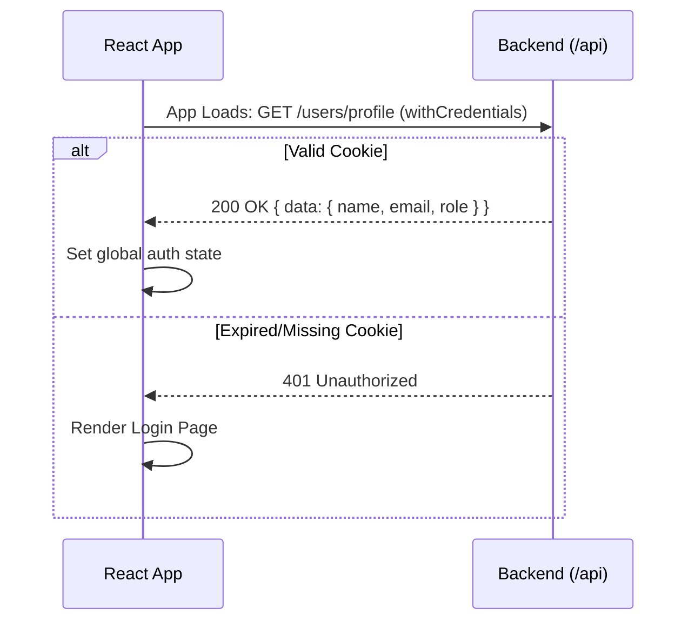

# 01 Auth Flow

This section details all public authentication routes.

## Sequence: Session Restoration



---
## Auth (Public)
### POST `/api/auth/register`
- **Auth required:** Public
- **Purpose:** Register a new student account
- **Request payload:**
  ```json
  {
    "name": "Test Student",
    "email": "test_register@campuscoin.com",
    "password": "password123"
  }
  ```
- **Success response (201):** *(Backend automatically sets `jwt` cookie)*
  ```json
  {
    "success": true,
    "message": "Registered successfully",
    "data": {
      "_id": "6ab625aeee47afc10550842d",
      "name": "Test Student",
      "email": "test_register@campuscoin.com",
      "role": "student"
    }
  }
  ```
- **Error responses:**
  - **400 Validation failed:** `{"success":false,"error":"Validation failed","errors":[]}`
  - **409 Email exists:** `{"success":false,"error":"User already exists"}`

---
### POST `/api/auth/login`
- **Auth required:** Public
- **Purpose:** Log in as a student
- **Request payload:**
  ```json
  {
    "email": "student@campuscoin.com",
    "password": "password123"
  }
  ```
- **Success response (200):** *(Backend automatically sets `jwt` cookie)*
  ```json
  {
    "success": true,
    "message": "Logged in successfully",
    "data": { "role": "student" }
  }
  ```
- **Error responses:**
  - **401 Invalid credentials:** `{"success":false,"error":"Invalid email or password"}`
  - **403 Disabled account:** `{"success":false,"error":"Your account has been disabled"}`

---
### POST `/api/auth/admin-login`
- **Auth required:** Public
- **Purpose:** Log in as an admin
- **Request payload:** Same as login.
- **Success response (200):** Same as login, but `role` will be `"admin"`.
- **Error responses:**
  - **403 Not an admin:** `{"success":false,"error":"Access denied. Admin only."}`

---
### POST `/api/auth/logout`
- **Auth required:** Public
- **Purpose:** Log out user and clear cookie
- **Request payload:** None
- **Success response (200):**
  ```json
  {
    "success": true,
    "message": "Logged out successfully"
  }
  ```

---
### POST `/api/auth/forgot-password`
- **Auth required:** Public
- **Purpose:** Request password reset token (mocked email in dev)
- **Request payload:**
  ```json
  { "email": "student@campuscoin.com" }
  ```
- **Success response (200):**
  ```json
  {
    "success": true,
    "message": "If your email is registered, a password reset link has been sent to it.",
    "data": null
  }
  ```

---
### POST `/api/auth/reset-password`
- **Auth required:** Public
- **Purpose:** Reset password using token
- **Request payload:**
  ```json
  {
    "token": "{{resetToken}}",
    "newPassword": "newpassword123"
  }
  ```
- **Success response (200):**
  ```json
  {
    "success": true,
    "message": "Password has been reset successfully"
  }
  ```
